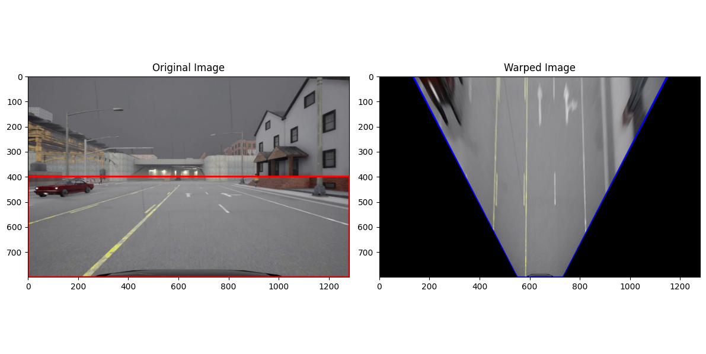

# **Inverse Perspective Mapping (IPM) Tool**

### Easy IPM
also known as Bird's Eye View (BEV) 
## **Overview**
This repository provides an simplest and easy-to-use tool for transforming a perspective view image (e.g., a road scene) into a **Bird's Eye View (BEV)**, also known as **Inverse Perspective Mapping (IPM)**. BEV is widely used in applications like autonomous driving, robotics, and image analysis to simplify tasks such as lane detection, object tracking, and navigation. Tool especially for such as road signs, poth holes etc..

## **How It Works**
1. **Input Image**: Provide a perspective image with a region of interest (e.g., a road).
2. **Define Points**: Select four points on the image that outline the region to transform (e.g., a trapezoid representing the road).
3. **Apply Transformation**: The tool calculates a transformation matrix to map these points to a rectangular area in the BEV.
4. **Output Image**: Get a top-down, geometrically accurate representation of the selected region.

## **Key Features**
- **User-Friendly Interface**: Simply define your points, and the tool does the rest.
- **Fast and Lightweight**: Designed for real-time applications.
- **Customizable**: Easily modify points and transformation parameters to suit your application.

## **Applications**
- **Autonomous Driving**: Lane detection, obstacle detection, and navigation.
- **Robotics**: Path planning and scene understanding.
- **Image Processing**: Area analysis and geometry correction.

## **Example Output**
| Original Image               &    Bird's Eye View                  |
|------------------------------------------------------------------|
|          |

## **How to Use**
1. Define the points (`original_points`) on the input image that outline the region of interest (e.g., road lanes).
2. Modify the destination points (`destination_points`) for the BEV output.
3. Run the script to generate the transformed image.

## **Contributing**
We welcome contributions! Feel free to:
- Open an issue for bugs or feature requests.
- Fork the repo and submit a pull request.

## **License**
This project is licensed under the [MIT License](LICENSE).

## **Acknowledgments**
- Built with [OpenCV](https://opencv.org) for image processing.
- Inspired by real-world applications in autonomous driving and robotics.

--- 

